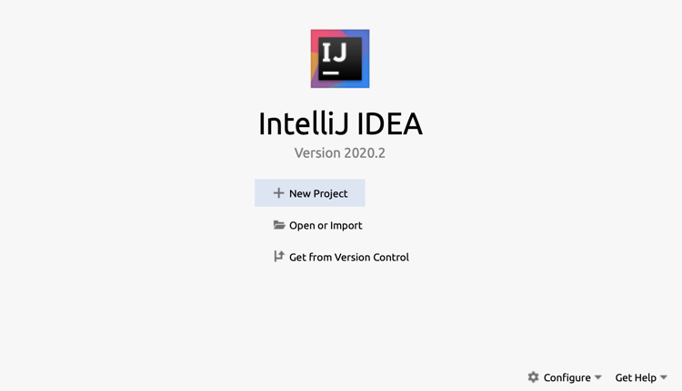
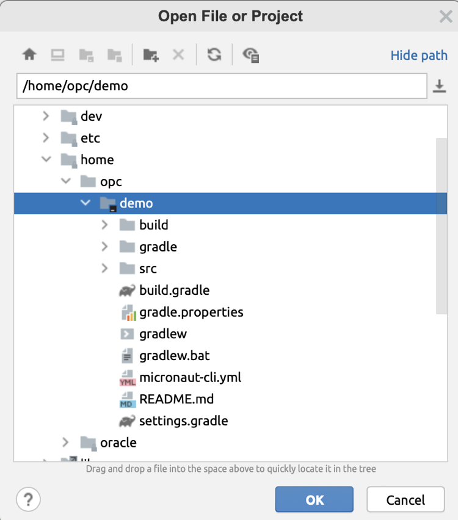

# Prerequisites

## Before We Begin

This workshop is is designed to be delivered virtually and entirely through your web browser hence the only prerequisite is a modern browser such as Chrome, Edge or Firefox.

This avoids the need for attendees to get setup locally with the necessary tooling and development environment. The enviornment provided is pre-configured with:

* Micronaut 2.2.0
* GraalVM 20.3.0 for JDK 11
* The Oracle Cloud CLI
* Docker
* JetBrains Projector IDE

Prior to beginning your instructor will provide you with web address to access the in-browser Cloud IDE which will be used for the remainder of the workshop to demonstrate how to build applications with Micronaut and deploy them to Oracle Cloud.

The IDE is based on JetBrains Projector and you should perform the following steps before you begin:

1. Navigate to the URL provided by your instructor
2. You will likely receive an HTTPS warning about the certificate, in Chrome you should click "Advanced" and then the "Proceed" link to continue.
3. If for any reason the page doesn't load try hit the refresh button.
4. From the "Project Dialog" select "Open or Import"

    

5. Navigate to `/home/opc/demo` and open the directory

        

    