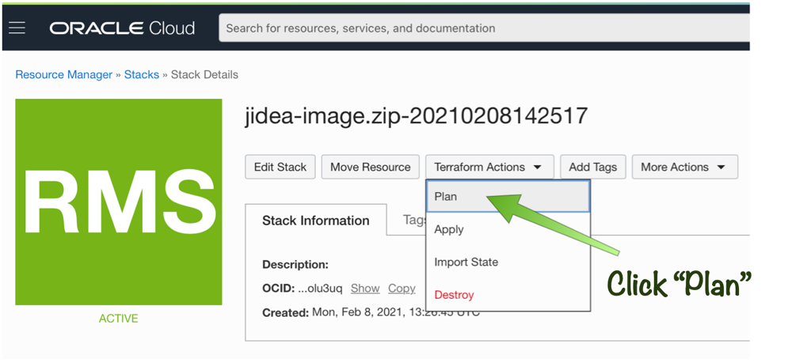
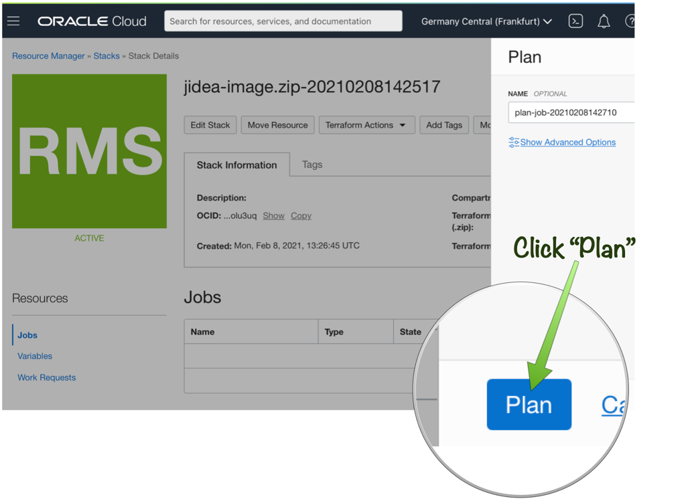
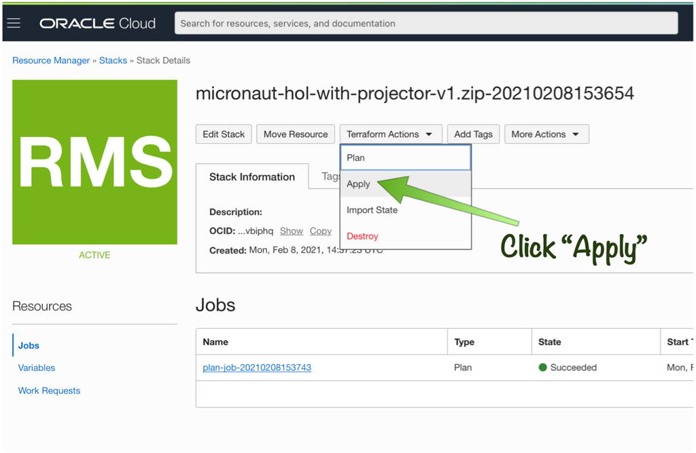
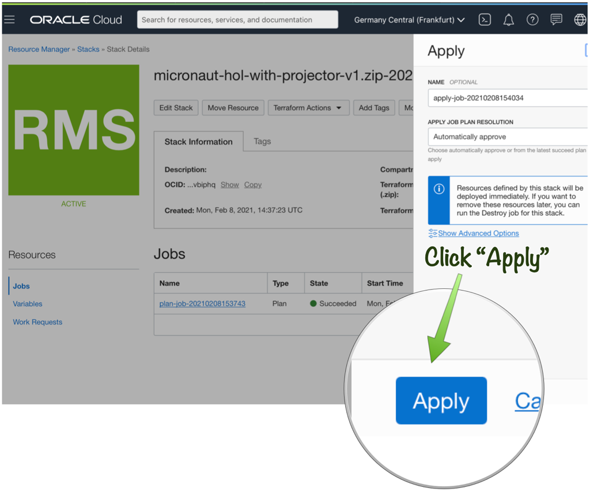

# Prerequisites

## Before We Begin
This workshop is designed to be delivered virtually and entirely through your web browser hence the only prerequisite is a modern browser such as Chrome, Edge or Firefox.

This avoids the need for attendees to get setup locally with the necessary tooling and development environment. The virtual environment provided is pre-configured with:

* Micronaut 2.3.1
* GraalVM 21.0.0 for JDK 11
* The Oracle Cloud CLI
* Docker
* JetBrains Projector IDE 

## Setup Virtual Environment
Prior to beginning, the lab you need to create the virtual environment to run the lab. The virtual environment requires that you have completed the sign-up for Oracle Cloud as described in the [Signup for Oracle Cloud](index.html?lab=signup-for-oracle-cloud) section.

Once you have your Oracle Cloud account ready, click the following button:

[![Create Oracle Cloud Stack][magic_button]][magic_jidea_terraform_stack]

[magic_button]: https://oci-resourcemanager-plugin.plugins.oci.oraclecloud.com/latest/deploy-to-oracle-cloud.svg
[magic_jidea_terraform_stack]: https://cloud.oracle.com/resourcemanager/stacks/create?zipUrl=https://objectstorage.us-ashburn-1.oraclecloud.com/n/cloudnative-devrel/b/micronaut-hol/o/terraform%2Fmicronaut-hol-with-projector-v1.zip

Clicking the button will take you to Oracle Cloud Resource Manager where you will use a pre-prepared Terraform stack to initialize the infrastructure for the lab.

From the "Create Stack" screen accept the terms and conditions then click "Next" as seen below:

On the next page leave all the settings on the defaults and click "Next" again as seen below:

On the next page leave all the settings on the defaults and click "Create" again as seen below:

Now that you have a Terraform stack, it is time to plan the execution by clicking "Terraform Actions" -> "Plan" from the "Stack Details" page as shown below:

Then click the "Plan" button on the bottom right to trigger a new job that will plan the Terraform execution:

Note that the Terraform execution plan will run and may take a couple of minutes to complete. Once it has completed successfully go back to the "Stack Details" page and click "Terraform Actions" -> "Apply" as shown below:

Then click the "Apply" button on the bottom right to trigger a new job that will apply the Terraform execution:

Actually applying the Terraform stack can take up to 15 minutes to complete. Once complete the applied stack will output several variables including the IP address of a machine that is running a virtual instance of IntelliJ Community Edition accessible via a modern web browser (preferably Chrome-based).

## Launch IDE in Web Browser
To find the the URL of your IDE instance navigate to the "Outputs" of the plan you ran in the previous section and copy the "projector_link" value and paste it into your browser navigation bar (good idea to bookmark the link just in case!).

The IDE is based on JetBrains Projector with IntelliJ Community Edition and you should perform the following steps before you begin:

1. Navigate to the URL provided in the output of the stack in the previous section
2. You will likely receive an HTTPS warning about the certificate. In Chrome you should click "Advanced" and then the "Proceed" link to continue.
3. If for any reason the page doesn't load try hit the refresh button. Note that it can take a minute or two before the IDE server is up and running so keep refreshing until it does.
4. Accept the Terms and Conditions of use the IDE
5. Choose either Gradle or Maven when prompted depending on your build tool preference.

    

The example project you will use during the course of this lab will automatically open up and you should see the following project:

