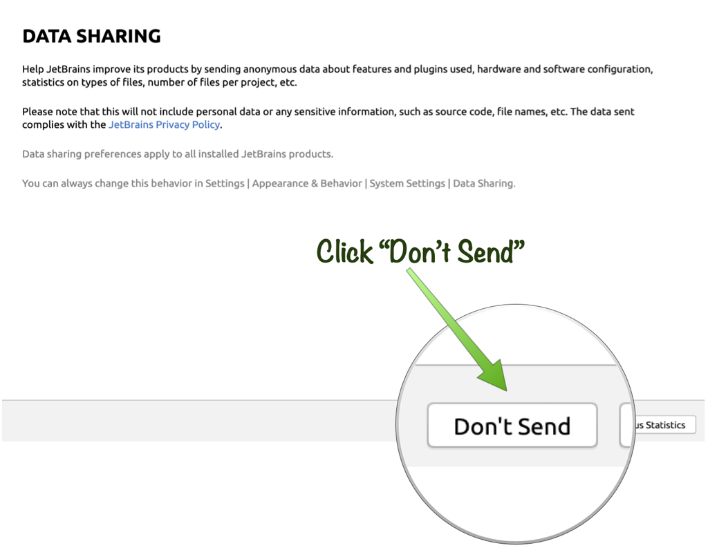

# Prerequisites

## Before We Begin
This workshop is designed to be delivered virtually and entirely through your web browser hence the only prerequisite is a modern browser such as Chrome, Edge or Firefox.

This avoids the need for attendees to get setup locally with the necessary tooling and development environment. The virtual environment provided is pre-configured with:

* Micronaut 2.3.1
* GraalVM 21.0.0 for JDK 11
* The Oracle Cloud CLI
* Docker
* JetBrains Projector IDE 

## Setup Virtual Environment
Prior to beginning, the lab you need to create the virtual environment to run the lab. The virtual environment requires that you have completed the sign-up for Oracle Cloud as described in the [Signup for Oracle Cloud](index.html?lab=signup-for-oracle-cloud) section.

The lab uses [Oracle Cloud Resource Manager](https://www.oracle.com/devops/resource-manager/) and Terraform to create a virtual environment including the following:

* An instance of Autonomous Database
* A Virtual Machine to run the Projector Cloud IDE
* A Virtual Cloud Network (VCN)

> **WARNING:** Since this lab uses virtual resources it is important to shut these resources down when you have finished the lab to avoid incurring unneeded costs. Lab 16 on "Terminating Cloud Resources" explains how to use Terraform to shutdown all cloud resources.

Once you have your Oracle Cloud account ready, click the following button:

[![Create Oracle Cloud Stack][magic_button]][magic_jidea_terraform_stack]

[magic_button]: https://oci-resourcemanager-plugin.plugins.oci.oraclecloud.com/latest/deploy-to-oracle-cloud.svg
[magic_jidea_terraform_stack]: https://cloud.oracle.com/resourcemanager/stacks/create?zipUrl=https://objectstorage.us-ashburn-1.oraclecloud.com/n/cloudnative-devrel/b/micronaut-hol/o/terraform%2Fmicronaut-hol-with-projector-v3.zip

Clicking the button will take you to Oracle Cloud Resource Manager where you will use a pre-prepared Terraform stack to initialize the infrastructure for the lab.

From the "Create Stack" screen accept the terms and conditions then click "Next" as seen below:

On the next page leave all the settings on the defaults and click "Next" again as seen below:

On the next page leave all the settings on the defaults and click "Create" again as seen below:

Now that you have a Terraform stack, it is time to apply the stack by clicking "Terraform Actions" -> "Apply" from the "Stack Details" page as shown below:

Then click the "Apply" button on the bottom right to trigger a new job that will apply the Terraform execution:

Actually applying the Terraform stack can take up to 15 minutes to complete. Once complete the applied stack will output several variables including the IP address of a machine that is running a virtual instance of IntelliJ Community Edition accessible via a modern web browser (preferably Chrome-based).

While you wait enjoy the presentation material from your instructor for the workshop.

## Launch IDE in Web Browser
To find the the URL of your IDE instance navigate to the "Outputs" of the plan you ran in the previous section and copy the "projector_link" value and paste it into your browser navigation bar (good idea to bookmark the link just in case!).

The IDE is based on JetBrains Projector with IntelliJ Community Edition and you should perform the following steps before you begin:

1. Navigate to the URL provided in the output of the stack in the previous section
2. You will likely receive an HTTPS warning about the certificate. In Chrome you should click "Advanced" and then the "Proceed" link to continue.
3. If for any reason the page doesn't load try hit the refresh button. Note that it can take a minute or two before the IDE server is up and running so keep refreshing until it does.
4. Accept the Terms and Conditions of use the IDE

	

5. Either agree or not to send usage statistics

		

6. Choose either Gradle or Maven when prompted depending on your build tool preference.

    

The example project you will use during the course of this lab will automatically open up and you should see the following project:

## Alternative Setup Method

If you have trouble getting setup on Oracle Cloud with the Virtual lab you can alternatively complete the workshop using local development tools.

You will need GraalVM 21.0.0 for Java 8 installed which you can install via SDKMan with:

	<copy>
	sdk install java 21.0.0.2.r8
	</copy>

Or alternatively you can [download and install it manually](https://www.graalvm.org/downloads/).

Once you have GraalVM simply create a new Micronaut application via [Micronaut Launch](https://micronaut.io/launch) called "example" or via `curl`:

	<copy>
	curl https://launch.micronaut.io/example.zip -o example.zip && unzip example.zip -d example && cd example
	</copy>

The above command will create the example application that can be used as a starting point to work through the workshop locally.	

> **TIP**: If you don't have `curl` you can also create an application with [Micronaut Launch](https://micronaut.io/launch)

You can then open the created project in an IDE or text editor.
