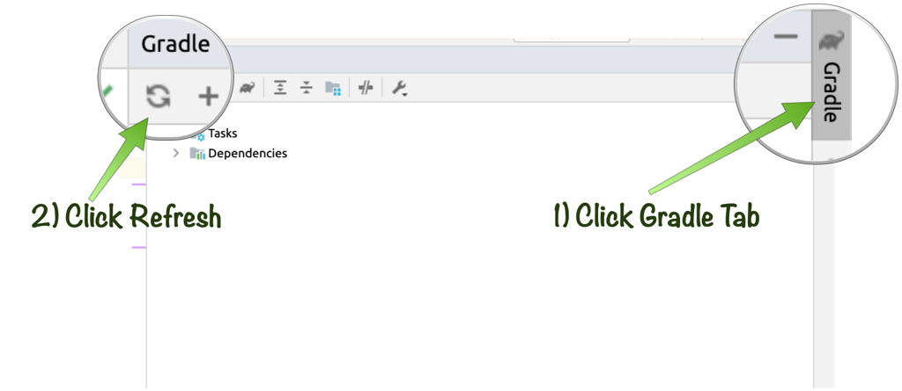

# Building Native Images with Micronaut & GraalVM

## Introduction
In this lab you will learn how to turn your application into a native executable with GraalVM Native Image.

Estimated Lab Time: 10 minutes

### Objectives

In this lab you will:
* Understand the benefits and tradeoffs with AOT compilation
* Build a native executable from your Micronaut application
* Run the executable on a VM or with Docker

### Prerequisites
- Access to your project instance

## Overview of Native Image

[GraalVM Native Image](https://www.graalvm.org/reference-manual/native-image/) is a technology that allows performing a closed world static analysis of a Java application and turn the Java application into a native executable designed to execute on a specific target environment.

Whilst building a native image can take some time the benefits include a dramatic reduction in startup time and reduced overall memory consumption both of which can significantly reduce the cost of running Cloud applications over time.

## Configuring Native Image Support

To get started modify your Gradle build by adding the following dependencies to your `build.gradle` file within the `dependencies` block:

	<copy>
	annotationProcessor("io.micronaut:micronaut-graal")
	</copy>

Or if you are using Maven add `micronaut-graal` under `<annotationProcessorPaths>`:

	<copy>
    <path>
      <groupId>io.micronaut</groupId>
      <artifactId>micronaut-graal</artifactId>
      version>${micronaut.version}</version>
    </path>
	</copy>	

Before proceeding you should refresh your project dependencies:

	

Next since this application needs to establish a secure connection to Autonomous Database you need to pass the `--enable-all-security-services` flag to native image. 

To do this with Gradle add the following to `build.gradle`:

	<copy>
	nativeImage {
	    args("--enable-all-security-services")
	}
	</copy>

Finally, if you chose to use JPA/Hibernate (Lab 11 instead of Lab 10) then you need to add the following definition `@TypeHint` to your `Application` class:

<copy>
import io.micronaut.core.annotation.TypeHint;

@TypeHint(Pet.PetHealth.class)
public class Application {

    public static void main(String[] args) {
        Micronaut.run(Application.class, args);
    }
}
</copy>

Whilst Micronaut doesn't use reflection itself (and Micronaut Data JDBC doesn't aswell), third-party libraries like Hibernate that do may need reflection configuration. The `@TypeHint` annotation allows the inner `PetHealth` enum to be accessed reflectively by Hibernate.

Any other classes that you need to add reflectively can be added to the `@TypeHint` annotation as required.

## Building a Native Image with Gradle

If you are using Gradle and the GraalVM SDK with Native Image installed (Native Image is an optional component installable via `gu install native-image`) then building a native image is trivial.

Open up the Terminal pane and run the following command:

	<copy>
	./gradlew nativeImage
	</copy>

After some time the native image executable with be built to `build/native-image/application`.

You can now run the native executable from Terminal:

	<copy>
	./build/native-image/application
	</copy>

## Building a Native Image with Maven

If instead you are using Maven then a slightly different command is needed. Try run:

<copy>
./mvnw package -Dpackaging=native-image -Dmicronaut.native-image.args="--enable-all-security-services"
</copy>

Which will build the native image into the `target/native-image` directory which you can run with:

	<copy>
	./target/application
	</copy>

You may now *proceed to the next lab*.

### Acknowledgements
- **Owners** - Graeme Rocher, Architect, Oracle Labs - Databases and Optimization
- **Contributors** - Palo Gressa, Todd Sharp, Eric Sedlar