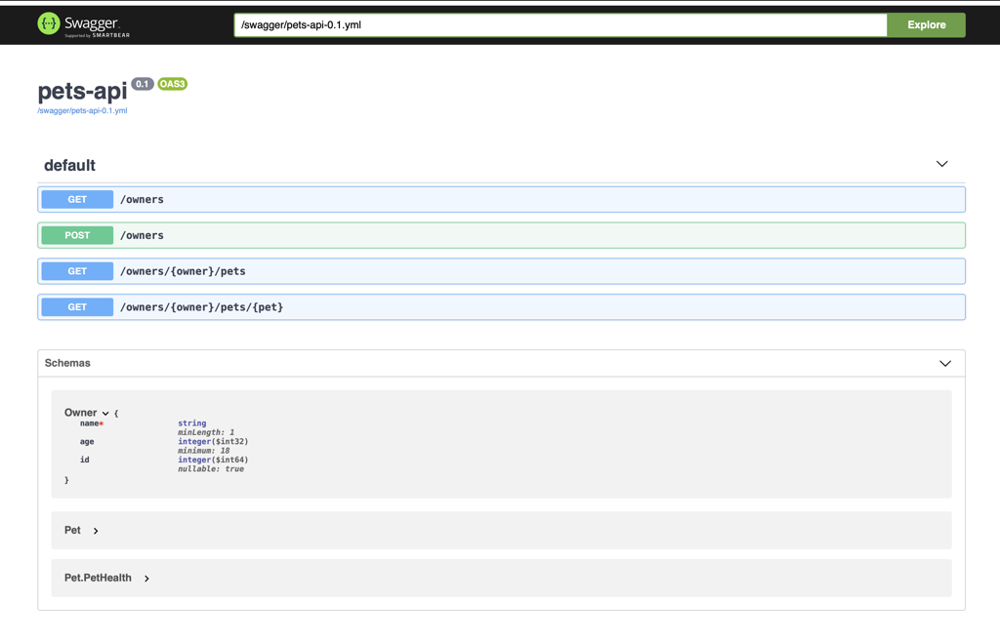
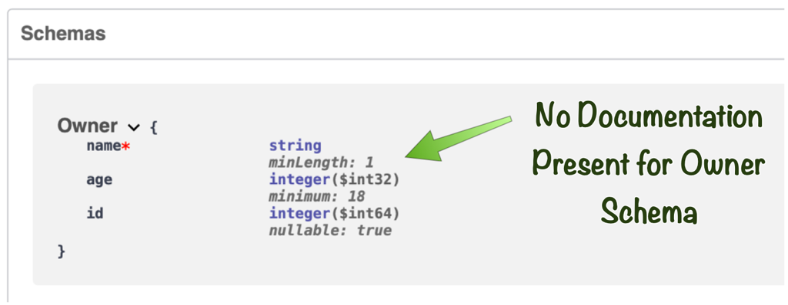
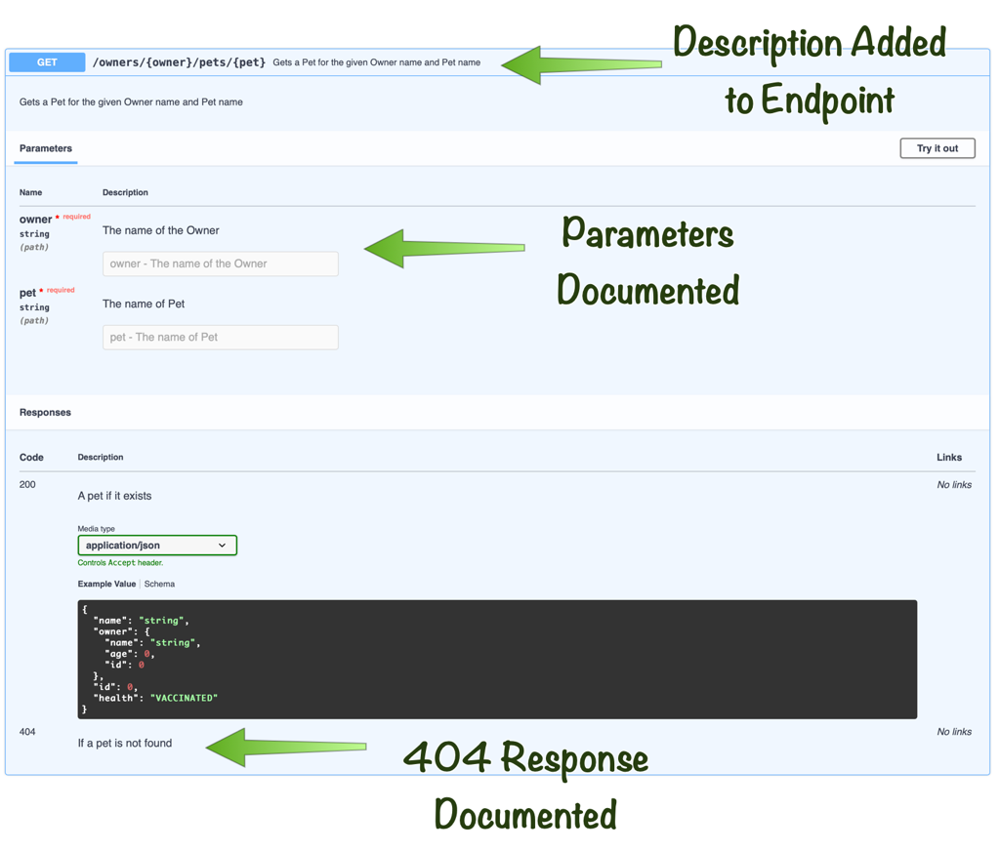
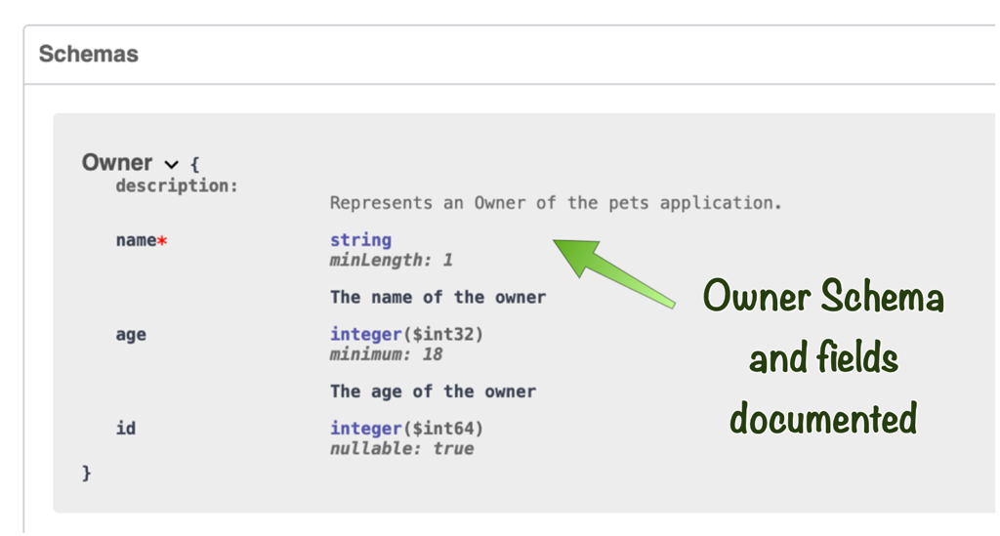

# Creating API Documentation with OpenAPI

## Introduction
In this lab you will learn how to use Micronaut's support for OpenAPI and Swagger to generate API documentation.

Estimated Lab Time: 20 minutes

### Objectives

In this lab you will:
* Learn how to configure and enable the generation of API documentation
* Expose API documentation via Swagger UI
* Understand how Web Controllers map to your API
* Improve your API with javadoc and annotations

### Prerequisites
- Access to your project instance

## Configuring OpenAPI Generation

A common requirement is the need to document a REST API for consumers. [OpenAPI](https://swagger.io/specification/) has emerged as an industry standard for this task.

Micronaut features the ability to [generate your API documentation](https://micronaut-projects.github.io/micronaut-openapi/latest/guide/index.html) directly from your source code and javadoc comments, greatly reducing the need to duplicate effort when documenting your API.

To get started modify your Gradle build by adding the following dependencies to your `build.gradle` file within the `dependencies` block:

    <copy>
    annotationProcessor("io.micronaut.openapi:micronaut-openapi")
    implementation("io.swagger.core.v3:swagger-annotations")
    </copy>

Or if you are using Maven first add the `swagger-annotations` dependency under `<dependencies>`:

    <copy>
    <dependency>
        <groupId>io.swagger.core.v3</groupId>
        <artifactId>swagger-annotations</artifactId>
        <scope>compile</scope>
    </dependency>
    </copy>

Then add `micronaut-openapi` under `<annotationProcessorPaths>`:

    <copy>
    <path>
      <groupId>io.micronaut.openapi</groupId>
      <artifactId>micronaut-openapi</artifactId>
      <version>${micronaut.openapi.version}</version>
    </path>
    </copy>

Before proceeding you should refresh your project dependencies:

Now edit your `Application` class and add the following annotations to the class:

    <copy>
    @OpenAPIDefinition(
        info = @Info(
            title = "pets-api",
            version = "0.1"
        )
    )
    </copy>

You'll also need these imports:

    <copy>
    import io.swagger.v3.oas.annotations.OpenAPIDefinition;
    import io.swagger.v3.oas.annotations.info.Info;
    </copy>

With that in place open Terminal and run `./gradlew compileJava` and you will see output like:

    Task :compileJava
    Note: Generating OpenAPI Documentation
    Note: Writing OpenAPI YAML to destination: .../build/classes/java/main/META-INF/swagger/pets-api-0.1.yml

Congratulations - you are producing an initial version of the API!

## Exposing Swagger UI

Micronaut produces a static OpenAPI YAML file in the `META-INF/swagger` directory. To expose the OpenAPI documentation via the HTTP server you can configure this path as a static resource in `application.yml`:

    <copy>
    micronaut:
      router:
        static-resources:
          swagger:
            paths: classpath:META-INF/swagger
            mapping: /swagger/**
    </copy>

To serve Swagger UI documentation, create a file named `openapi.properties` in the root of your project with the following definition:

    <copy>
    swagger-ui.enabled=true
    </copy>

Now open Terminal and run your application with `./gradlew run` or `./mvn mn:run` for Maven and navigate to `http://[YOUR IP]:8080/swagger/views/swagger-ui/index.html`.

> NOTE: Remember to use the `http` protocol when accessing the instance on port 8080 and not `https` otherwise you will receive an error.

You will see the generated API documentation:

## Improving API Documentation

Looking at the produced documentation, you will notice that an explanation of how the API works is a little thin currently. For example the endpoint for `/{owner}/pets/{pet}` lacks any descriptive documentation:

Also the generated `Owner` schema lacks documentation:

To resolve these issues, first add some javadoc to the `Owner` entity describing the class and the properties:

    <copy>
    /**
     * Represents an Owner of the pets application.
     */
    @MappedEntity
    public class Owner {
        // remaining code omitted for brevity

        /**
         * The name of the owner
         */
        public String getName() {
            return name;
        }

        /**
         * The age of the owner
         */
        public int getAge() {
            return age;
        }
    }
    </copy>

Next add javadoc API documentation to the endpoint:

    <copy>
    /**
     * Gets a Pet for the given Owner name and Pet name
     * @param owner The name of the Owner
     * @param pet The name of Pet
     * @return A pet if it exists
     */
    @Get("/{owner}/pets/{pet}")
    @ApiResponse(responseCode = "404", description = "If a pet is not found")
    Pet getPet(String owner, String pet) {
        return ownerOperations.getPet(owner, pet);
    }
    </copy>

You'll also need this import:

    <copy>
    import io.swagger.v3.oas.annotations.responses.ApiResponse;
    </copy>

In this case in addition to the javadoc, the `io.swagger.v3.oas.annotations.responses.ApiResponse` annotation is used to document what happens in the case a `Pet` is not found. When `null` is returned from a controller method in Micronaut a 404 response is automatically produced.

Now from terminal run the application again and access the OpenAPI documentation at `http://[YOUR IP]:8080/swagger/views/swagger-ui/index.html`.

> NOTE: Remember to use the `http` protocol when accessing the instance on port 8080 and not `https` otherwise you will receive an error.

Note the improvements to the API documentation:

And the schema documentation:

Micronaut uses the documentation already present in your source code to enhance your API!

You may now *proceed to the next lab*.

### Acknowledgements
- **Owners** - Graeme Rocher, Architect, Oracle Labs - Databases and Optimization
- **Contributors** - Palo Gressa, Todd Sharp, Eric Sedlar
